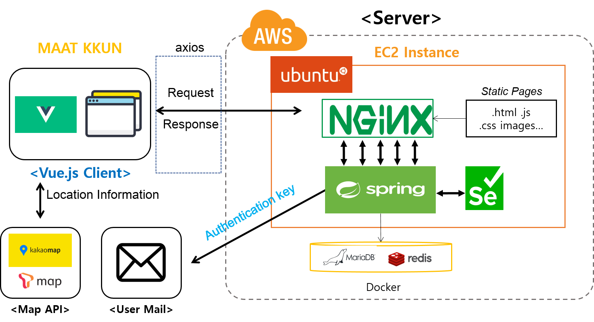
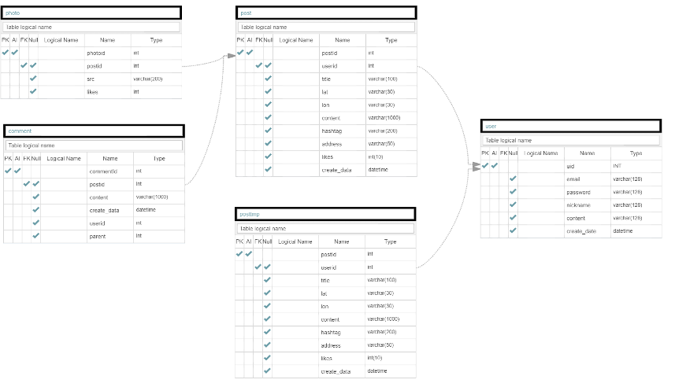

# MAAT KKUN

## 1. 프로젝트 개요

> 본 프로젝트는 맛집 오픈 블로그로 블로그 관리자만이 게시글을 올릴 수 있는 기존의 블로그와는 달리 시스템 회원이라면 누구든지 맛집과 관련된 포스팅을 할 수 있다는 차별점이 있다.

### System Architecture

### Usecase Diagram

.png)

### ERD

## 2. 프로젝트를 위한 환경 설정

* 시스템 개발 환경

  * Language : JavaScript, Java, CSS, HTML
  * Framework : Spring Boot, VueJS
  * Code Editor : Visual Studio Code
  * Windows Version : Windows 10
* 시스템 운영 환경
  * Cloud Server : AWS EC2
  * OS : Ubuntu
  * DB : MariaDB, Redis
  * Web Server : nginx

#### 3. 주요 기능

* 사용자 맞춤 코스 추천
* 메뉴 자동 추가
* 실시간 게시글 인기 순위